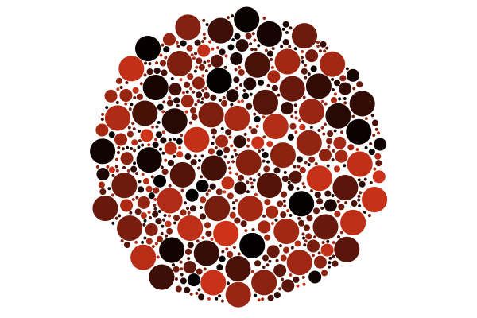
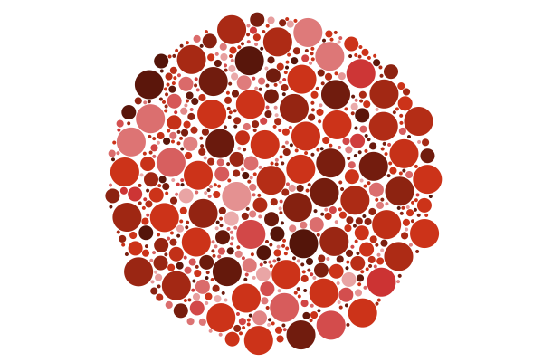
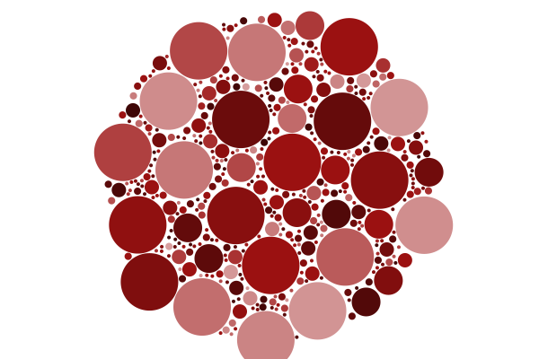
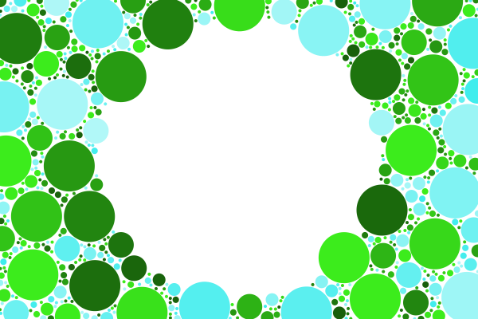
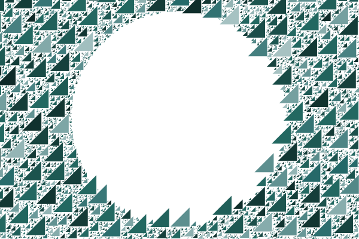
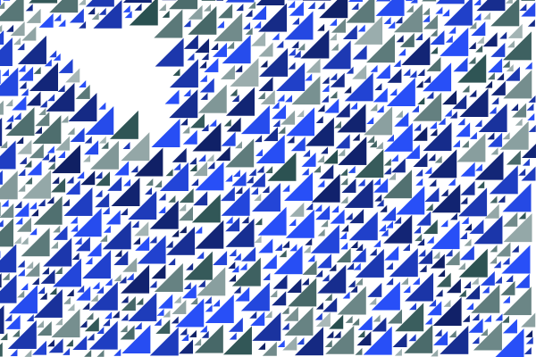
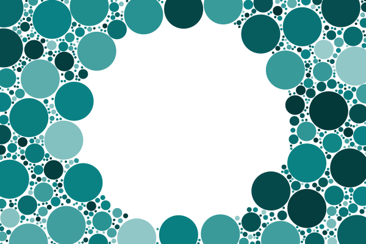
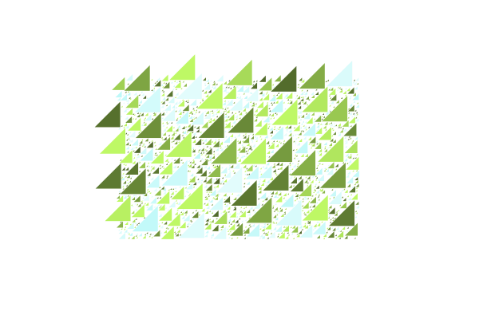
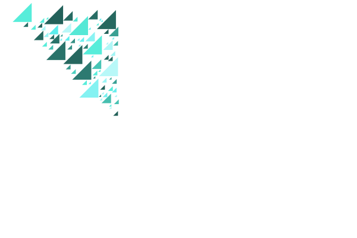

# Circle packing

Requires Cairo installed.

https://cairographics.org/download/

https://medium.com/@bit101/intro-to-cairo-graphics-in-rust-35470a6aed86
http://gtk-rs.org/docs/cairo/struct.Context.html#method.set_source_rgb

## in circles

## in polyhedrons

## inverse

## triangles

### TODO
- loads of tidying
- different shapes (not just circles)
- params - take in shape co-ords, options (circle/shape), base colour, size
- quad-tree
- better colour randomisation
- allow overlap
- colour gradiation
- improve triangle speed
- make sure all triangle points are in circle/polygon

## Nice links

https://sighack.com/post/circle-packing-using-stochastic-search
http://www.tylerlhobbs.com/writings/circle-packing
